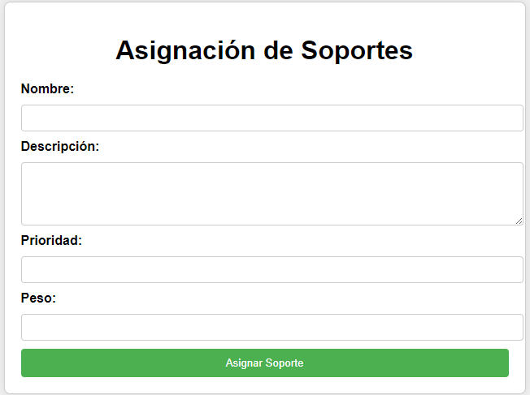
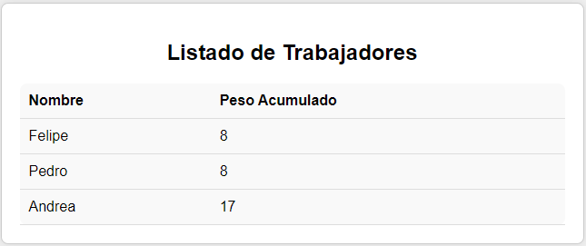

# Sistema de Asignación de Soportes

## Descripción

Este sistema permite asignar soportes a trabajadores y visualizar el estado actual de asignaciones y trabajadores.

### Asignación de Soportes

Para asignar un soporte, utiliza el siguiente formulario:



- **Nombre:** Nombre del soporte a realizar.
- **Descripción:** Descripción básica del soporte.
- **Prioridad:** Prioridad del soporte (5 es la mayor prioridad, 1 es la menor).
- **Peso:** Peso del soporte (5 es el mayor peso, 1 es el menor).

### Listado de Trabajadores y Peso Acumulado

En esta tabla puedes ver el listado de trabajadores con su respectivo peso acumulado:



---

## Creación de la Base de Datos

La base de datos utilizada tiene las siguientes credenciales:

- **BD:** Makrosoft_Test_MVallejo
- **Usuario:** postgres
- **Contraseña:** password

### Creación de Tablas

```sql
CREATE TABLE public.soportes (
    id SERIAL PRIMARY KEY,
    nombre VARCHAR(100) NOT NULL,
    descripcion VARCHAR(200) NOT NULL,
    prioridad INTEGER NOT NULL,
    peso INTEGER NOT NULL,
    trabajador_asignado INTEGER REFERENCES public.trabajador(id) ON DELETE SET NULL
);

CREATE TABLE public.trabajador (
    id SERIAL PRIMARY KEY,
    nombre VARCHAR(50) NOT NULL,
    peso_acumulado INTEGER DEFAULT 0
);```

``` Inserción de Datos Iniciales en la Tabla Trabajador

INSERT INTO public.trabajador (nombre, peso_acumulado) VALUES
    ('Pedro', 0),
    ('Felipe', 0),
    ('Andrea', 0);```